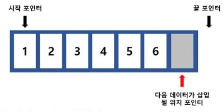
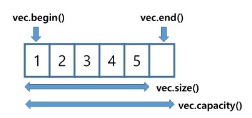
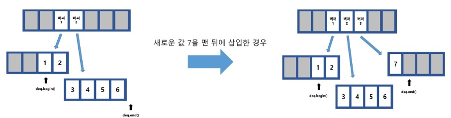
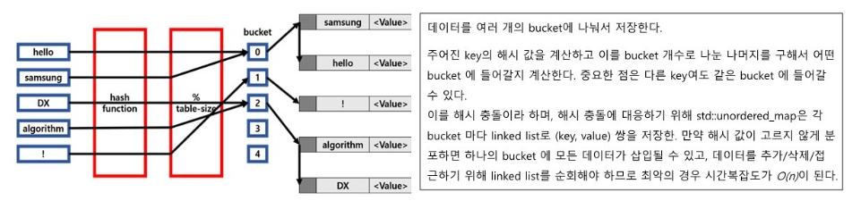

# STL 이란?

- C++의 표준 템플릿 라이브러리 (Standard Template Library)

- 주요 라이브러리

​	Container - 임의 타입의 객체를 보관할 수 있는 컨테이너 
​		vector, list, set/map, deque, multiset/map, unordered_set/map, stack, queue, priority_queue 등

​	Iterator - 컨테이너에 보관된 원소에 접근할 수 있는 반복자
​		input/output iterators, forward/bidirectional iterators, random access iterators

​	Algorithm - 반복자들을 가지고 일련의 작업을 수행하는 알고리즘
​		sort, find, transform, for_each, generate, binary_search

- C++ - https://en.cppreference.com/w/ 자세한 내용 참고

- Java - java.lang.util Package 참고

C++ STL의 Containers library를 중점으로 알아볼 것.


# Sequence Containers

Sequence Containers는 데이터를 순차적으로 저장하는 구조
구현이 단순하고 가볍고 빠름. 저장할 데이터가 정렬 상태를 계속 유지할 필요 없다면 좋은 선택
std:: array, std::vector, std::deque, std::forward_list, std:: list


# std:: vector

std::vector는 메모리 상에서 데이터가 연속적으로 저장됨.
vectors는 배열의 크기를 runtime에 조절할 수 있지만, array의 크기는 컴파일 타임에 결정되어야 함.
사용할 배열의 크기를 미리 알 수 있고 변하지 않는다면 array, 그렇지 않다면 vector를 선택.

vector는 포인터 3개로 구현되어 있다.

 	1) 할당된 배열의 시작 주소를 가리키는 포인터
 	2)  다음에 데이터가 삽입될 위치를 가리키는 포인터
 	3) 할당된 배열의 끝 주소를 가리키는 포인터

데이터를 뒤에 삽입하면 2번 포인터에 삽입되고, 포인터가 1 증가한다.

std::vector의 iterator멤버를 사용하면 begin(), end()함수를 사용 가능.

size(), capacity()함수를 사용하면 데이터가 삽입된 개수(size)와 vector에 할당된 실제 크기(capacity)를 확인 가능



임의의 위치에 있는 원소의 접근을 O(1) 에 수행. 맨 뒤에 새로운 원소 추가/제거 역시 O(1)에 수행.

임의의 원소 접근은 배열처럼 [] 을 이용하거나 at함수 사용

맨 뒤에 원소추가할때는 push_back함수, 제거할때는 pop_back함수 사용

```c++
[std::vector 사용 예시 코드]
#include <iostream>
#include <vector>

int main(){
	std::vector<int> vec;
	vec.push_back(1); //맨 뒤에 1 추가
	vec.push_back(2); //맨 뒤에 2 추가
	vec.pop_back();   //맨 뒤에 있는 데이터 제거
	
	for(std::vector<int>::size_type i=0; i<vec.size(); i++){
		std::cout<< "vec의" << i+1 << "번째 원소::" << vec[i] << std::endl;
	}
}
```

vector 데이터 삽입시 주의사항

push_back 연산은 상수 시간복잡도를 가지나, 할당된 공간이 전부차면 배열을 통째로 복사해

새로운 vector에 할당하는 reallocation이 발생해 시간이 많이 소요된다.

따라서 알고리즘 문제 풀이 시에는 가급적 vector의 크기를 충분히 확보한 상태로 사용하는 것이 좋다.

vector에서 임의의 위치에 원소를 추가하거나 제거 할때 시간복잡도는 O(n) 으로 상당히 느림. 그 뒤에 오는 원소들을 한칸 씩 이동시켜 줘야하기 때문.


# std::deque

container 앞,뒤에 데이터를 빠르게 넣고 뺄 수 있는 double-ended queue. 여러 개의 버퍼에 데이터를 나눠서 저장한다. vector는 할당된 공간이 전부 차면 배열을 통째로 새로 할당하는 반면, deque는 버퍼 하나만 할당하면 되므로 데이터 삽입이 언제든 O(1)이다.
컨테이너의 앞과 뒤에 데이터 삽입/삭제 기능이 동시에 필요한 경우, deque는 유용한 선택이 된다.



# deque vs vector

vector의 원소들은 메모리상에 연속적으로 존재하는것이 보장되지만, deque는 원소들이 실제로 메모리 상에서 연속적으로 존재하지 않음. 이로 인해 원소들이 어디에 저장되어 있는지에 대한 정보를 보관하기 위해 추가적인 메모리가 더 필요하다. 따라서 C배열의 라이브러리와 상호작용해야 하는상황이거나, 공간지역성을 고려해야하는 상황에서는 deque가 불리한 점이 있다.

```c++
[std::deque 사용 예시 코드]
#include <iostream>
#include <deque>

int main(){
	std::deque<int> dq;
	dq.push_back(1); //맨 뒤에 1 추가
	dq.push_back(2); //맨 뒤에 2 추가
	dq.pop_front();   //맨 앞에 있는 원소 제거
}
```

# std::list

std::list는 양방향 연결 구조를 가진 linked list
Container의 어느 위치에도 O(1)에 데이터 삽입/삭제 가능 (포인터를 갖고 있는 경우)
하지만 시작 원소와 마지막 원소의 위치만 기억하기 때문에 random access (Container의 i번째 데이터에 O(1)에 접근)은 불가능하다.

```c++
[std::list 사용 예시 코드]
#include <iostream>
#include <list>

int main(){
	std::list<int> mylist;
	
	mylist.push_back(1); // push_back: 리스트 제일 뒤에 원소 추가
	mylist.push_back(2); 
	mylist.push_front(0);   // push_front: 리스트 제일 앞에 원소 추가
	
	for(std::list<int>::iterator itr = mylist.begin(); itr != mylist.end(); ++itr){
		std::cout<< *itr << std::endl; // 0 1 2 출력
	}
	return 0;
}
```

std::list에서 iterator의 경우 ++, --와 같은 연산으로만 증감이 가능하다. 다시말해 오직 한칸씩만 움직일 수 있다. itr + 2 와 같이 임의의 위치에 있는 원소를 가리킬 수 없다.


# std::list(std::forward_list)

std::list는 doubly_linked list이고, std::forward_list는 singly-linked list이다.
singly-lined list는 삽입과 삭제는 지정된 원소의 다음 원소에 한해서만 가능한 제약이 있지만 doubly-linked list에 비해 포인터를 하나 덜 가지므로 기본적인 연산이 빠르고 메모리를 적게 사용한다.
만약 doubly-linked list의 기능까지 필요하지 않다면 더 가볍고 빠른 forward_list가 좋은 선택이다.

# Associative Containers

Associatvie Containers는 데이터를 정렬된 상태로 유지하는 자료구조이다.
키(key)- 값(value) 구조를 통해 요소에 빠른 접근은 가능하지만 삽입되는 요소의 위치를 지정할 수는 없다.
Red-Black Tree를 기반으로 하고 데이터의 추가/삭제/접근의 시간복잡도가 O(log n)이다.
Red-Black Tree:
	자가 균형 이진 탐색 트리(self-balancing binary search tree)로서, 대표적으로는 연관 배열 등을 구현하는 데 쓰이는 자료구조이다. 트리에 n개의 원소가 있을 때 O(log n)의 시간복잡도로 삽입, 삭제, 검색을 할 수 있으며 최악의 경우에도 우수한 실행 시간을 가진다.
std::set/ std::map 
std::multiset/ std::multimap 

# std::set/ std::map 

Red-Black Tree는 Binary Search Tree이므로 어떤 key를 기준으로 데이터를 저장한다.

- std::set은 데이터 자체를 key로 사용한다. 따라서 저장하는 값이 key가 되고 오름차순으로 정렬된다. 검색 속도가 O(log N)이기 때문에 데이터의 존재 유무를 파악하는데 유용하다. (key 중복 허용 X)

```c++
[std::set 사용 예시 코드]
#include <iostream>
#include <set>

int main(){
	std::set<int> myset;
	myset.insert(1); 
	myset.insert(2); 
	
	std:set<int>::iterator itr;
	itr = myset.find(2);
	if(itr != myset.end()){
		//myset에 2가 있는 경우
	}
	else{
		//myset에 2가 없는 경우
	}
}
```

- std::map은 (key, value) 쌍을 받아서 사용한다. (key, value) 데이터를 묶어서 빠르게 검색할 때 유용하다. 하나의 key에는 하나의 vlaue만 연결된다. (key 중복 허용 X)

	```c++
	[std::map 사용 예시 코드]
	#include <iostream>
	#include <string>
	#include <map>
	
	int main(){
		std::map<std::string,int> mymap;
		
		mymap["Tom"] = 20;
		mymap["Sally"] = 23;
		
		std::map<std::string, int>::iterator itr;
		for(itr = mymap.begin(); itr!=mymap.end(); itr++){
			std::cout<< "key:" << itr->first <<  "value:" << itr->second << std::endl; 
		}
	}
	```

	따라서 단순히 데이터를 정렬 상태로 유지하고 존재 유무만 알고 싶다면 std::set을, (key, value) 데이터 쌍을 key를 기준으로 정렬하고 싶다면 std::map을 사용하면 된다.

	# std::multiset / std::multimap

	std::multiset과 std::multimap은 요소의 중복을 허용한다. 즉, 같은 key를 여러 개 저장하고 싶을 때 사용한다. multimap에서는 하나의 key가 여러 value와 연결될 수 있다.

	단, 시간복잡도 주의가 필요하다. set에서 key의 개수를 세거나, key를 지우는 함수는 모두 O(log n)이지만, multiset에서는 같은 key를 모두 세고, 모두 지우므로 O(log n + (같은 key를 가지는 데이터의 개수)) 만큼의 시간이 든다.

	```c++
	[std::multiset 사용 예시 코드]
	#include <iostream>
	#include <set>
	
	int main(){
		std::multiset<int> myset;
		
		myset.insert(2);
		myset.insert(1);
		myset.insert(2);
		myset.insert(3);
		//set은 1 2 3 출력, multiset은 1 2 2 3 출력
		for(auto& i:myset){
			std::cout<< i << std::endl;
		}
	}
	```

	# Unordered Associative Containers

	해시값을 사용해 데이터를 저장하는 구조
	대부분의 경우에서 데이터의 추가/삭제/접근이 O(1) 이므로 Associative Container보다 효율적이다. 하지만 데이터를 정렬된 상태로 유지해야 하거나 (무수히 많은 key 값들로 인해) 해시 충돌이 걱정되는 상황이라면 Associative Container를 사용하는 게 좋다.

	std::unordered_set /std::unordered_map
	std::unordered_multiset /std::unordered_multimap

# std::unordered_set /std::unordered_map

Data를 중복 없이 저장하고 싶고, Data의 순서가 상관없을 때 Associative Container 대신 사용할 수 있다.
std::unordered_map의 데이터 저장 방식



기본으로 사용하는 hash function은 std::hash이고, std::hash에서 기본으로 지원하는 타입은 int, double 등의 primitive type과 std::string 등이 있다.


# std::unordered_multiset /std::unordered_multimap

Associative Container 때와 마찬가지로, 같은 key를 가진 데이터를 중복으로 가져야 할 때 사용된다.
set, map의 경우 원소들이 순서대로 정렬되어서 저장되지만, unordered_set, unordered_map은 원소들이 순서대로 정렬되어서 저장되지 않는다.

```c++
[std::unordered_set 사용 예시 코드]
#include <iostream>
#include <unordered_set>

int main(){
	std:unordered_set<int> myset;
	
	myset.insert(5);
	myset.insert(2);
	myset.insert(10);
	myset.insert(4);
	myset.insert(300);
	myset.insert(77);
	// 77 5 10 2 4 300 모든 원소를 iterator를 사용하여 출력해보면 정렬되지 않은 채 랜덤하게 나온다.
	for(auto& i:myset){
		std::cout<< i << std::endl;
	}
}
```

# Container adaptors

기존 Container를 변경하여 특정 인터페이스만을 제공한다.

[std::stack]

LIFO (Last-In, First-Out) 자료구조로 순차 컨테이너를 기반으로 구현되며, default 기반 컨테이너는 std::deque이다. push(저장), pop(삭제), top(접근) 함수를 사용하며 순차 컨테이너의 한 끝에서만 모든 연산이 적용된다.

[std::queue]

FIFO (First-In, First-Out) 자료구조로 순차 컨테이너를 기반으로 구현되며, default 기반 컨테이너는 std::deque이다. front접근) 함수를 사용하며 순차 컨테이너의 한 끝에서만 저장이 가능하고 반대쪽 끝에서는 데이터 삭제만 가능하다. (정의: template<class T, class Container = std::deque> class queue)

[std::priority_queue]

순차 컨테이너를 기반으로 구현되며, default 기반 컨테이너는 std::vector이다. Container를 max heap으로 유지한다. push(저장), pop(삭제), top(접근) 함수를 사용하며 데이터의 우선순위가 큰 순서대로 접근 할 수 있다.

문제

- 수열 편집
- 메모장 프로그램