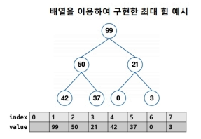

Heap

부모와 자식 간 일정한 대소 관계가 성립하는 완전 이진 트리

완전 이진 트리(Complete Binary Tree)란?
마지막 레벨을 제외한 모든 레벨이 완전히 채워져 있고, 마지막 레벨에서는 가능한 왼쪽에서부터 채워진 이진 트리, 즉 노드가 왼쪽부터 순차적으로 채워지는 트리

최대 힙 (Max Heap)
부모가 자식보다 큰 값을 가지고 있는 완전 이진 트리
루트 노드에는 항상 가장 큰 값이 들어 있다.

최소 힙 (Min Heap)
부모가 자식보다 작은 값을 가지고 있는 완전 이진 트리
루트 노드에는 항상 가장 작은 값이 들어 있다.

특징

- 최댓값, 최솟값을 찾는 데에 O(1)의 계산이 가능해진다.
- 전체 자료를 정렬하는 것이 아니라 가장 큰 값 또는 작은 값만 몇 개 필요한 경우 주로 사용된다.
- 힙 구조를 만드는 데에 O(N) 만큼의 시간이 소요된다.
- 힙의 데이터를 삽입, 삭제 하는 데에 O(log N) 만큼의 시간이 소요된다.

Heap 구현
배열을 완전 이진트리처럼 사용하여 힙을 구현할 수 있다.
배열의 0번 인덱스는 버리고, 배열의 1번인덱스를 루트 노드로 사용한다



자식 인덱스 구하는 법
왼쪽 자식 인덱스 = (부모 인덱스) * 2
오른쪽 자식 인덱스 = (부모 인덱스) * 2 + 1

부모 인덱스 구하는 법
부모 인덱스 = (자식 인덱스) / 2

C++ 최대 힙 클래스 구현

간단하게 3가지 동작을 구현해보자
힙에 데이터를 넣는 push
힙에서 최대값을 반환하는 top
힙에서 최대값을 삭제하는 pop

```c++
class MaxHeap {
	static constexpr size_t MAX_N = 100000; // 힙 최대 사이즈 설정
	int data[MAX_N + 1]; // 데이터가 담을 배열
	size_t size = 0;	 // 현재 힙 사이즈
	
public:
	MaxHeap() = default;
	
	// 두 노드의 값을 바꾸는 함수
	void swap(int& a, int& b) {...}
	
	// 힙에 데이터 삽입
	void push(int x) {
		
		// 가장 끝 노드에 새로운 값 추가
		data[++size] = x;
		
		int index = size;			 // 새로 추가한 노드의 인덱스
		int parent = (index / 2); 	// 새로 추가한 노드의 부모 인덱스
	
		// 새로 추가한 노드의 값이 부모 노드의 값보다 크다면
		while ( parent != 0 && data[index] > data[parent]) {
			// max 힙 특성을 만족하도록 두 노드의 위치를 바꿈
			swap(data[index], data[parent]);
			
			// 위로 올라가면서 힙 특성을 만족하는지 검사
			index = (index / 2);
			parent = (index / 2);
		}
	}
	
	// 최대값 리턴
	int top() const {
		// 힙이 비어있는지 체크
		assert(size != 0);
		
		// 최대값(루트 노드에 있는 값) 반환
		return data[1];
	}
	
	// 힙에서 최대값 삭제
	void pop() {
		// 힙이 비어있는지 체크
        assert(size != 0);
        
        // 마지막 노드 루트 노드로 이동
        data[1] = data[size--];
        
        // 루트 노드에서부터 시작하여 힙 특성을 만족하는지 검사
		 // 루트 노드를 부모 노드로 놓고
        int parent = 1;
       
        // 부모, 왼쪽자식, 오른쪽자식 중 가장 큰 값을 찾을 거임
        int large = parent; // 먼저 부모의 인덱스가 가장 큰 인덱스라고 설정함
        int left = (parent*2) // 왼쪽 자식 인덱스
        int right = (parent*2 + 1) // 오른쪽 자식 인덱스
            
        while (true) {
            // 왼쪽 자식 인덱스가 가장 큰 값이면 왼쪽 자식 인덱스를 가장 큰 인덱스로 설정
            if ( left <= size  && data[left]>data[large])
                large = left;
            // 오른쪽 자식 인덱스가 가장 큰 값이면 오른쪽 자식 인덱스를 가장 큰 인덱스로 설정
            if ( right <= size  && data[left]>data[large])
                large = right;
            
            // 부모, 왼쪽자식, 오른쪽 자식 중 부모가 가장 큰 경우
            if ( large == parent)
                break; // 힙 구조를 만족하므로 더이상 수행 할 작업 없음
            
            // 부모, 왼쪽자식, 오른쪽 자식 중 부모가 가장 큰 값이 아닌 경우
            else {
                // 더 큰 값을 가지는 자식과 부모의 값을 바꾸고
                swap(data[parent], data[large]);
                
                // 값이 바뀐 노드를 부모노드로 설정하여 힙 특성을 만족하는지 다시 검사
                parent = large;
                left = (parent * 2);
                right = (parent * 2 + 1);
            }
        }
	}
};
```

Heap 정렬

힙 구조를 이용하여 정렬을 수행할 수 있다

1) 힙 구조를 만든다
2) 루트 노드에 있는 값을 뺀다

위 1, 2번 과정을 계속 반복해주면된다. 
힙에서 pop을 반복하는 것이라고 볼 수 있다.
힙 구조를 만드는 데에 O(N) 만큼의 시간이 소요된다.
루트 노드에 있는 값을 빼고 다시 힙 구조를 만드는 데에 O(log N) 만큼 소요되고 이 고자ㅓㅇ을 노드 개수만큼 N번 반복하면 힙 정렬을 하는 데에  O(NlogN ) 만큼 시간이 소요된다고 볼 수 있다.
