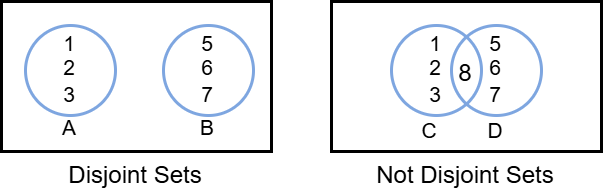
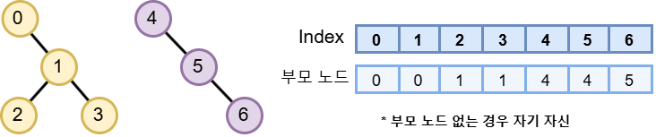
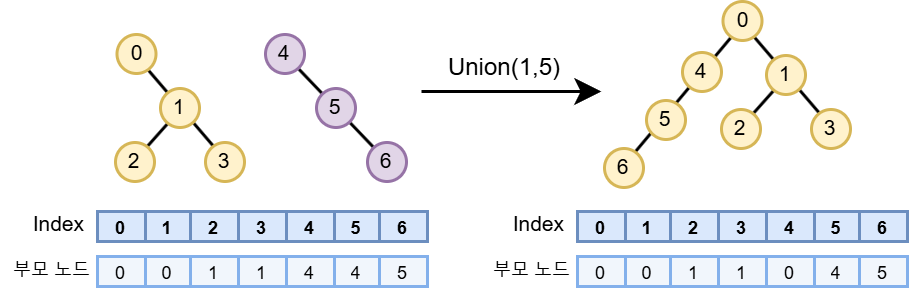

## 1. Union-Find의 정의와 필요성

### 1.1 Union-Find란?
- **정의**: 상호 배타적 집합(서로소 집합)(Disjoint-Set)을 표현할 때 사용하는 그래프 알고리즘
- **역할**: 임의의 두 노드(원소)가 서로 같은 그래프(집합)에 속하는지 판별하는 알고리즘
- **구현**: 집합을 트리 구조를 이용하여 구현

### 1.2 Disjoint-Set이란?
- **정의**: 공통원소가 없는 "상호 배타적인" 부분집합들로 나눠진 원소들에 대한 정보를 표현하는 자료구조
- **주요 연산**:
  - **Union (합치기)**: 두 원소가 속한 집합을 하나로 합침
  - **Find(찾기)**: 해당 원소가 속한 집합을 반환



## 2. Union-Find의 동작 원리

### 2.1 기본 원리
이 알고리즘의 핵심은 각각의 집합을 트리로 나타내는 것이다.
Union-Find를 사용하면 특정 노드가 어느 집단에 속해 있는지 알 수 있다.

### 2.2 시간복잡도
- 트리의 구조를 사용해서 시간복잡도가 평균적으로 O(log N)
- 편향될 경우 O(N)이 될 수 있음
- 경로 압축 (Path Compression), Rank기반 연산을 통해 최적화하여 상수에 가깝게 만들 수 있음



## 3. Union-Find 구현

### 3.1 초기화
parent[x] = x가 속한 집합의 번호 (자기자신)으로 초기화

```c++
int parent[MAX_SIZE];

void initialize() {
	for(int x=0; x < MAX_SIZE; x++)
		parent[x] = x;
}
```

### 3.2 Find 연산
Node x의 Root를 찾음
부모 노드가 자기 자신일 때까지 타고 올라감 (재귀 함수)

```c++
int Find(int x) {
	if( x == parent[x] )
		return x;
	else
		return Find(parent[x]);
}
```

### 3.3 Union 연산
Node a와 Node b를 합침
b의 root의 부모를 a의 root로 연결

```c++
void Union(int a, int b) {
	int A = Find(a); // root of a
	int B = Find(b); // root of b
	
	parent[B] = A;
}
```



## 4. Union-Find 최적화

### 4.1 Path Compression
Find에서 root를 찾는 경우 최악의 상황에서 O(N) 만큼의 계산 요구

예시:


Find(3)의 경우 모든 노드 탐색 요구

-> 경로 압축 방법(Path Compression)이 필요

Find는 Depth가 낮을 수록 유리함
-> 매번 Find할 때 Depth가 2 이상이면 Path compression 수행


Path Compression 수행 시 Find에 대한 계산 복잡도 단축
특징: Root node를 원하는 값으로 강제할 수 있음

### 4.2 Union-by-rank
rank에 트리의 높이(rank)를 저장
항상 높이(rank)가 더 낮은 트리를 높은 트리 밑에 넣음

```c++
void Union(int a, int b) {
	int A = Find(a); // root of a
	int B = Find(b); // root of b
	
	if (A==B)
		return;
	if(rank[A] < rank[B]) 
		parent[A] = B;
	else if (rank[A] > rank[B])
		parent[B] = A;
	else {	// rank[A] == rank[B]
		parent[B] = A;
		rank[A]++;
	}  
}
```


