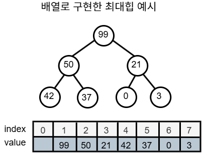

## 1. Heap의 정의와 필요성

### 1.1 Heap이란?
- **정의**: 부모와 자식 간 일정한 대소 관계가 성립하는 완전 이진 트리
- **완전 이진 트리**: 마지막 레벨을 제외한 모든 레벨이 완전히 채워져 있고, 마지막 레벨에서는 가능한 왼쪽에서부터 채워진 이진 트리
  - 즉 노드가 왼쪽부터 순차적으로 채워지는 트리

### 1.2 Heap의 종류
1. **최대 힙 (Max Heap)**
   - 부모가 자식보다 큰 값을 가지고 있는 완전 이진 트리
   - 루트 노드에는 항상 가장 큰 값이 들어 있음

2. **최소 힙 (Min Heap)**
   - 부모가 자식보다 작은 값을 가지고 있는 완전 이진 트리
   - 루트 노드에는 항상 가장 작은 값이 들어 있음

## 2. Heap의 특징

### 2.1 시간복잡도
- 최댓값, 최솟값을 찾는 데에 O(1)의 계산이 가능
- 전체 자료를 정렬하는 것이 아니라 가장 큰 값 또는 작은 값만 몇 개 필요한 경우 주로 사용
- 힙 구조를 만드는 데에 O(N) 만큼의 시간이 소요
- 힙의 데이터를 삽입, 삭제 하는 데에 O(log N) 만큼의 시간이 소요

## 3. Heap 구현

### 3.1 배열 기반 구현
배열을 완전 이진트리처럼 사용하여 힙을 구현할 수 있음
배열의 0번 인덱스는 버리고, 배열의 1번인덱스를 루트 노드로 사용



### 3.2 인덱스 계산
- **자식 인덱스 구하는 법**
  - 왼쪽 자식 인덱스 = (부모 인덱스) * 2
  - 오른쪽 자식 인덱스 = (부모 인덱스) * 2 + 1

- **부모 인덱스 구하는 법**
  - 부모 인덱스 = (자식 인덱스) / 2

### 3.3 C++ 최대 힙 클래스 구현
간단하게 3가지 동작을 구현해보자:
- 힙에 데이터를 넣는 push
- 힙에서 최대값을 반환하는 top
- 힙에서 최대값을 삭제하는 pop

```c++
class MaxHeap {
    static constexpr size_t MAX_N = 100000; // 힙 최대 사이즈 설정
    int data[MAX_N + 1]; // 데이터가 담을 배열
    size_t size = 0;     // 현재 힙 사이즈
    
public:
    MaxHeap() = default;
    
    // 두 노드의 값을 바꾸는 함수
    void swap(int& a, int& b) {...}
    
    // 힙에 데이터 삽입
    void push(int x) {
        // 가장 끝 노드에 새로운 값 추가
        data[++size] = x;
        
        int index = size;             // 새로 추가한 노드의 인덱스
        int parent = (index / 2);     // 새로 추가한 노드의 부모 인덱스
    
        // 새로 추가한 노드의 값이 부모 노드의 값보다 크다면
        while (parent != 0 && data[index] > data[parent]) {
            // max 힙 특성을 만족하도록 두 노드의 위치를 바꿈
            swap(data[index], data[parent]);
            
            // 위로 올라가면서 힙 특성을 만족하는지 검사
            index = (index / 2);
            parent = (index / 2);
        }
    }
    
    // 최대값 리턴
    int top() const {
        // 힙이 비어있는지 체크
        assert(size != 0);
        
        // 최대값(루트 노드에 있는 값) 반환
        return data[1];
    }
    
    // 힙에서 최대값 삭제
    void pop() {
        // 힙이 비어있는지 체크
        assert(size != 0);
        
        // 마지막 노드 루트 노드로 이동
        data[1] = data[size--];
        
        // 루트 노드에서부터 시작하여 힙 특성을 만족하는지 검사
        int parent = 1;        // 루트 노드를 부모 노드로 놓고
        int large = parent;    // 부모, 왼쪽자식, 오른쪽자식 중 가장 큰 값을 찾을 거임
        int left = (parent*2); // 왼쪽 자식 인덱스
        int right = (parent*2 + 1); // 오른쪽 자식 인덱스
            
        while (true) {
            // 왼쪽 자식 인덱스가 가장 큰 값이면 왼쪽 자식 인덱스를 가장 큰 인덱스로 설정
            if (left <= size && data[left] > data[large])
                large = left;
            // 오른쪽 자식 인덱스가 가장 큰 값이면 오른쪽 자식 인덱스를 가장 큰 인덱스로 설정
            if (right <= size && data[left] > data[large])
                large = right;
            
            // 부모, 왼쪽자식, 오른쪽 자식 중 부모가 가장 큰 경우
            if (large == parent)
                break; // 힙 구조를 만족하므로 더이상 수행 할 작업 없음
            
            // 부모, 왼쪽자식, 오른쪽 자식 중 부모가 가장 큰 값이 아닌 경우
            else {
                // 더 큰 값을 가지는 자식과 부모의 값을 바꾸고
                swap(data[parent], data[large]);
                
                // 값이 바뀐 노드를 부모노드로 설정하여 힙 특성을 만족하는지 다시 검사
                parent = large;
                left = (parent * 2);
                right = (parent * 2 + 1);
            }
        }
    }
};
```

## 4. Heap 정렬

### 4.1 Heap 정렬의 원리
힙 구조를 이용하여 정렬을 수행할 수 있음

1. 힙 구조를 만듦
2. 루트 노드에 있는 값을 뺌

위 1, 2번 과정을 계속 반복해주면 됨
힙에서 pop을 반복하는 것이라고 볼 수 있음

### 4.2 시간복잡도
- 힙 구조를 만드는 데에 O(N) 만큼의 시간이 소요
- 루트 노드에 있는 값을 빼고 다시 힙 구조를 만드는 데에 O(log N) 만큼 소요
- 이 과정을 노드 개수만큼 N번 반복하면 힙 정렬을 하는 데에 O(NlogN) 만큼 시간이 소요

### 4.3 Heap 정렬 구현
힙 구조를 이용하여 내림차순 정렬 구현을 해보자

1. **힙 구조 만들기**
   - 힙 구조를 만들기 위해서는 하단에 있는 노드에서부터 시작해서 루트 노드로 올라오면서 각각의 노드에서부터 힙 구조를 만족하도록 만들어주면 힙 구조가 완성됨

```c++
// 1. 힙 구조 만들기
// 리프 노드를 제외하고
// 하단 노드에서부터 루트 노드로 올라가면서
for (int i = n / 2; i >=1; i--) {
    // 힙 구조 만족하도록 만들기
    heapify(n, i);    
}

// 현재 노드(parent)를 기준으로 힙 구조를 만족하도록 만드는 함수
void heapify(int n, int parent){
    int min = parent; // 최소값을 부모노드로 설정
    int left = parent * 2;
    int right = parent * 2 + 1;
    
    // 왼쪽 자식이 부모보다 작은지 검사
    if (left <= n && arr[left] < arr[min])
        min = left;
    // 오른쪽 자식이 부모보다 작은지 검사
    if (left <= n && arr[right] < arr[min])
        min = right;
    
    // 자식중에 최소값이 있을 경우
    if (min != parent){
        // 부모와 자리를 바꾸고
        swap(arr[min], arr[parent]);
        
        // 바뀐 노드에서부터 다시 힙 구조 만족하도록 만들기
        heapify(n, min);
    }
}
```

2. **루트 노드에 있는 값을 빼는 것을 반복**
   - 루트노드에 있는 값을 빼고(pop) 루트노드에부터 다시 힙구조를 만족하도록 만드는 것을 반복

```c++
// 2. 루트 노드에 있는 값을 빼는 것을 반복
// 힙에서 pop하는 과정을 반복한다고 생각하면 됨
for (int n = N; n >= 1; n--){
    // 루트노드(최소값)와 마지막 노드를 스왑
    swap(arr[1], arr[n]);
    
    // 루트노드에서부터 힙 구조 만족하도록 만들기
    heapify(n-1, 1);
}
```

## 5. 우선순위 큐 (Priority Queue)

### 5.1 우선순위 큐란?
힙 구조를 사용하여 우선순위가 높은 데이터를 O(1)만에 탐색할 수 있게 해주는 자료구조

### 5.2 C++ 구현
queue를 include하여 사용
C++에서 숫자가 높을수록 우선순위가 높음
pop()은 데이터를 반환하지 않고 삭제만 함

```c++
#include <queue>

using namespace std;

int main() {
    // 우선순위 큐 생성
    priority_queue<int> pq;
    
    // 우선순위 큐에 데이터 추가
    pq.push(100);
    
    // 우선순위 큐에서 우선순위가 가장 높은 데이터 반환
    int top = pq.top();
    
    // 우선순위 큐에서 우선순위가 가장 높은 데이터 삭제하고 반환
    pq.pop();
    
    // 우선순위 큐에 들어있는 총 데이터 개수 반환
    int size = pq.size()
        
    // 우선순위 큐가 비어있으면 true, 비어있지 않으면 false 반환
    bool isEmpty = pq.empty();
}
```

### 5.3 C++ 우선순위 큐 최적화
C++ 에서 우선순위 큐는 기본적으로 max heap으로 동작
min heap으로 사용하기 위해서는 별도 처리 필요

1. **정렬 기준 변경하기**
   - 우선순위 큐 선언시 정렬 기준 설정

```c++
#include <queue>
#include <vector>

using namespace std;

int main() {
    // 낮은 숫자를 우선으로 하는 우선순위 큐 생성
    priority_queue<int, vector<int>, greater<int> > pq;
}
```

2. **마이너스 곱하기**

```c++
#include <queue>

using namespace std;

int main() {
    priority_queue<int> pq;
    
    int a = 1;
    int b = 2;
    
    // 숫자를 넣을 때 마이너스 곱하기
    pq.push(-a);
    pq.push(-b);
    
    // 숫자를 뺄 때 마이너스 곱하기
    int n = -pq.top();
    pq.pop();
}
```

### 5.4 Java 구현
java.util.PriorityQueue를 import 하여 사용
Java에서 숫자가 낮을수록 우선순위가 높음
poll()은 데이터를 반환하고 삭제도 함

```java
import java.util.PriorityQueue

public class Solution {
    
    public static void main(String[] args) {
        // 우선순위 큐 생성
        PriorityQueue<Integer> pq = new PriorityQueue<>();
        
        // 우선순위 큐에 데이터 추가
        pq.add(100);
        
        // 우선순위 큐에서 우선순위가 가장 높은 데이터 반환
        int peek = pq.peek();
        
        // 우선순위 큐에서 우선순위가 가장 높은 데이터 삭제하고 반환
        peek = pq.poll();
        
        // 우선순위 큐에 들어있는 총 데이터 개수 반환
        int size = pq.size()
        
        // 우선순위 큐가 비어있으면 true, 비어있지 않으면 false 반환
        bool isEmpty = pq.isEmpty();
    }
}
```

### 5.5 Java 우선순위 큐 최적화
Java에서 우선순위 큐는 기본적으로 min heap으로 동작
max heap으로 사용하기 위해서는 별도 처리 필요

1. **정렬 기준 변경하기**
   - 우선순위 큐 선언시 정렬 기준 설정

```java
public static void main(String[] args) {
    
    // 높은 숫자를 우선으로하는 우선순위 큐 생성
    PriorityQueue<Integer> pq = new PriorityQueue<>(new Comparator<Integer>(){
        @Override
        public int compare(Integer o1, Integer o2){
            return o2-o1;
        }
    });
}
```

2. **마이너스 곱하기**

```java
public static void main(String[] args) {

    PriorityQueue<Integer> pq = new PriorityQueue<>();
    
    int a = 1;
    int b = 2;
    
    // 숫자를 넣을 때 마이너스 곱하기
    pq.push(-a);
    pq.push(-b);
    
    // 숫자를 뺄 때 마이너스 곱하기
    int n = -pq.poll();
}
```

## 6. Priority_queue vs Multiset (C++)

### 6.1 공통점
- 중복된 원소를 허용
- 우선순위가 가장 높은 원소 탐색 가능 O(1)
- 원소 삽입 삭제 가능 O(log n)

### 6.2 차이점
- pq는 우선순위가 가장 높은 원소만을 탐색할 수 있지만 multiset은 우선순위가 가장 높은 원소 뿐만 아니라 다른 원소도 탐색할 수 있음
- pq는 원소 값을 반환하지만 multiset은 포인터를 반환하기 때문에, iterator 사용 가능
- pq는 힙구조를 사용하고 multiset은 자가 균형 이진트리 구조를 사용함
